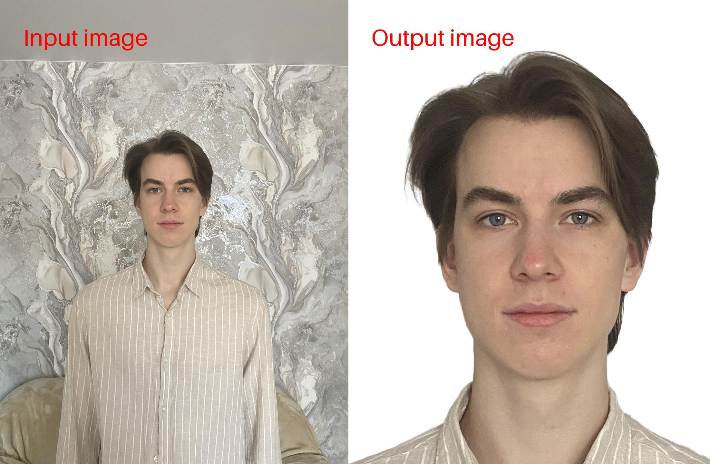

# PhotoDocsCreator

## Description

This project is an open source photo processing tool, the output of which is passport photos.

## Example

## How to install and run (On Linux)

#### Step 1: Clone the repository

'''bash
git clone git@github.com:VadosikRRR/PhotoDocsCreator.git -b dev
cd PhotoDocsCreator
'''

#### Step 2: Install packages

'''bash
pip install --no-upgrade -r requirements.txt
'''

#### Step 3: Download weights

Download the weights from the [link](https://drive.google.com/file/d/14-hSmX8IE1_WIX26WR-hSXdyPXb1wvTy/view?usp=sharing)

#### Step 4: Launch main file

'''bash
make
'''

## Link to face-parsing

The model from the [zllrunning repository](https://github.com/zllrunning/face-parsing.PyTorch) was used in the work
